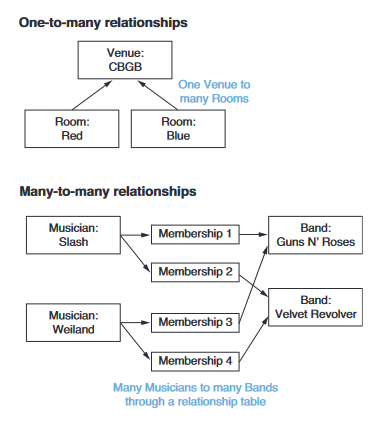

## Ch4 is about ORM models

### Start a new app bands
``` sh
./manage.py startapp bands
```

### Add to settings.py
``` python
INSTALLED_APPS = [
    'django.contrib.admin',
    'django.contrib.auth',
    'django.contrib.contenttypes',
    'django.contrib.sessions',
    'django.contrib.messages',
    'django.contrib.staticfiles',
    'home',
    'bands',
]
```

### Define the first ORM models
``` python
# create the first table called Musician
class Musician(models.Model):
    first_name = models.CharField(max_length=50)
    last_name = models.CharField(max_length=50)
    birth = models.DateField()

    # overwrite the base class to display a more meaningful object name
    def __str__(self):
        return f"Musician (id={self.id}, last_name={self.last_name})"

```

### Run 'makemigrations' and 'migrate'
``` sh
./manage.py makemigrations bands
./manage.py migrate
```

## Django ORM via CLI
You can interact with the database using the django shell
```sh
# Enter the django shell
./manage.py shell```
```

### .create()
``` python
# import required libraries
from bands.models import Musician
from datetime import date

# insert some data
Musician.objects.create(first_name="Steve", last_name="Vai", birth=date(1960, 6, 6))

Musician.objects.create(first_name="John", last_name="Lennon", birth=date(1940, 10, 9))

Musician.objects.create(first_name="John", last_name="Bonham", birth=date(1948, 7, 31))
```

### .objects Query
``` python
Musician.objects.all() # returns all the records

# Common practice to store the result in a variable
result = Musician.objects.all()
steve = result[0]

# other objects query
Musician.objects.first()  # returns the first record in the table
Musician.objects.last()  # returns the last record
```

### .filter()
This is like using the where clause in SQL
``` python
Musician.objects.filter(first_name="Steve")

# you can chain the methods together
result = Musician.objects.filter(first_name="John").first()
# or
result.first()
```


### Field Lookup
Field look-ups are modifications to a query arguments filter method.  For example to find first_name starting with "J".  
``` python
Musician.objects.filter(first_name__startswith="J")
```
Starting with double underscore (__) and the description of modification. Here are some common look-ups
| Look-up |  Description |
| -------- | ------------ |
| __contains | 	Contains the phrase |
| __icontains | 	Same as contains, but case-insensitive |
| __date  |	Matches a date |
| __day  |	Matches a date (day of month, 1-31) (for dates) |
| __endswith  |	Ends with |
| __iendswith | 	Same as endswidth, but case-insensitive |
| __exact  |	An exact match |
| __iexact  |	Same as exact, but case-insensitive |
| __in  |	Matches one of the values |
| __isnull  |	Matches NULL values |
| __gt  |	Greater than |
| __gte  |	Greater than, or equal to |
| __hour  |	Matches an hour (for datetimes) |
| __lt  |	Less than |
| __lte  |	Less than, or equal to |
| __minute  |	Matches a minute (for datetimes) |
| __month  |	Matches a month (for dates) |
| __quarter  |	Matches a quarter of the year (1-4) (for dates) |
| __range  |	Match between |
| __regex  |	Matches a regular expression |
| __iregex  |	Same as regex, but case-insensitive |
| __second  |	Matches a second (for datetimes) |
| __startswith  |	Starts with |
| __istartswith  |	Same as startswith, but case-insensitive |
| __time  |	Matches a time (for datetimes) |
| __week  |	Matches a week number (1-53) (for dates) |
| __week_day  |	Matches a day of week (1-7) 1 is Sunday |
| __iso_week_day | 	Matches a ISO 8601 day of week (1-7) 1 is Monday |
| __year | 	Matches a year (for dates) |
| __iso_year | 	Matches an ISO 8601 year (for dates) |

### Modifying data
``` python
Musician.objects.create(first_name="Roseanne", last_name="Barr", birth=date(1955, 7, 31))   # Is she a musician?

# use .get() to instantiate an object
roseanne = Musician.objects.get(id=5)
# .get() only returns a single match, so use a unique identifier like the pk 

# use the object to manipulate data: her birthday is actually 11/3/1952; update
roseanne.birth = date(1952, 11, 3)  # this only updates the object

# Have to save() to write to the database
roseanne.save()
```

### Deleting data
``` python
# I hate to classify Roseanne as a singer; remember that butchering of National Anthem?

roseanne.delete()  # Calling delete actually deletes the data in database, but not the class instance -- the variable roseanne still contains the values in the object

```

## Django MVT - Model, View, Template
## URL based views
Django uses URL based argument to query a specific record in the DB

For example:
```python
# proj/bands/urls.py
...
urlpatterns = [
    path('musician/<int:musician_id>/', views.musician, name='musician'),
    path('musicians/', views.musicians, name='musicians'),
]

# http://localhost:8000/bands/musician/1/
```

### function based views 
``` python
# proj/bands/views.py
from django.shortcuts import render, get_object_or_404

from bands.models import Musician

# List all the musicians record
def musicians(request):
    '''View for all the records.'''   
    data = {
        all_musicians = Musician.objects.all().order_by('last_name'),
    }

    return render(request, "musicians.html", data)

# Single, specific record
# using the built in 'get_object_404'
def musician(request, musician_id):
    '''View for single record.'''
    musician = get_object_or_404(Musician, id=musician_id)

    data = {
        "musician": musician,
    }

    return render(request, "musician.html", data)

```

### Templates
```html
<!-- proj/templates/musicians.html -->



    {{block.super}}: Musician Listing



    <h1>Musicians</h1>
    <ul>
        
            <li><a href="">
                {{musician.last_name}}, {{musician.first_name}}
            </a></li>
        
            <li> <i>No musicians in the database</i> </li>
        
    </ul>

```

```html
<!-- proj/templates/musician.html -->



    {{block.super}}: Musician Details



    <h1>{{musician.first_name}} {{musician.last_name}}</h1>
    <p> Was born {{musician.birth}}. </p>

```

## Database relationship
### one-to-many and many-to-many relationship


### ForeignKey field to link one-to-many
```python
...
class Venue(models.Model):
    name = models.CharField(max_length=20)

    def __str__(self):
        return f"Venue(id={self.id}, name={self.name})"


class Room(models.Model):
    name = models.CharField(max_length=20)
    venue = models.ForeignKey(Venue, on_delete=models.CASCADE)

    def __str__(self):
        return f"Room(id={self.id}, name={self.name})"
...
```
After the migrations, you should be able to use the Django built in query manager to query the foreigh relationship.  
 The query manager is named after the associated model
with ```_set``` stuck on the end. Your Venue model has a ```.room_set``` query manager.

Let's go back to django shell:
``` sh
./manage.py shell
>>> from bands.models import Venue, Room
>>> cbgb = Venue.objects.create(name="CBGB")
>>> red = Room.objects.create(name="Red", venue=cbgb)
>>> blue = Room.objects.create(name="Blue", venue=cbgb)
>>> red.venue
<Venue: Venue(id=1, name=CBGB)>
>>> red.venue.id
1
>>> red.venue.name
'CBGB'
>> cbgb.room_set.all()
<QuerySet [<Room: Room(id=1, name=Red)>, <Room: Room(id=2, name=Blue)>]>

```


### ManyToMany field to link many-to-many
many-to-many relationship requires an intermediary table; Django creates this automatically.
```python
...
class Band(models.Model):
    name = models.CharField(max_length=20)
    musicians = models.ManyToManyField(Musician)

    def __str__(self):
        return f"Band(id={self.id}, name={self.name})"
...
```
Back in django shell:
``` sh
./manage.py shell
>>> from bands.models import Band
>>> beatles = Band.objects.create(name="The Beatles")
>>> from bands.models import Musician
>>> lennon = Musician.objects.get(last_name="Lennon")
>>> lennon
<Musician: Musician(id=2, last_name=Lennon)>
```
The .add() method on the .musicians query manager adds a Musician
to the Band:
``` sh
>>> beatles.musicians.add(lennon)
>>> beatles.musicians.all()
<QuerySet [<Musician: Musician(id=2, last_name=Lennon)>]>
```
The Musician class now has a query manager named band_set. Using this
query manager, you can determine which bands a given musician belongs to:
``` sh
>>> lennon.band_set.all()
<QuerySet [<Band: Band(id=1, name=The Beatles)>]>
```
Because this is a many-to-many relationship, musicians can be associated with multiple bands. Let’s create a supergroup trio band, named Wishful Thinking, and add all three of our musicians:
```sh
>>> vai = Musician.objects.get(last_name="Vai")
>>> bonham = Musician.objects.get(last_name="Bonham")
>>> wishful = Band.objects.create(name="Wishful Thinking")
>>> wishful.musicians.add(lennon, vai, bonham)
>>> wishful.musicians.all()
<QuerySet [<Musician: Musician(id=1, last_name=Vai)>,
➥ <Musician: Musician(id=2, last_name=Lennon)>,
➥ <Musician: Musician(id=3, last_name=Bonham)>]
```

## Fixtures
A fixture is a text version of the data you have in your database.  Fixtures allow you to export and import database files

``` sh
# export data and input into 'bands.json' file
./manage.py dumpdata bands > bands.json

# or pretty print in screen
./manage.py dumpdata bands | python -m json.tool

# the opposite is to import the data 
./manage.py loaddata bands.json
```

Common practice to keep fixtures in its own directory
``` sh
mkdir bands/fixtures
mv bands.json bands/fixtures/
rm db.sqlite3
./manage.py migrate
./manage.py loaddata bands  # load the fixture using the app name instead of filename 
```