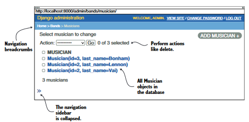

## Ch5 is about Admin

### minimum code to add a model in admin page 
```python
# proj/bands/admin.py
from django.contrib import admin
# import the model
from bands.models import Musician

admin.site.register(Musician)
```

### ModelAdmin class to register an admin page
```python
from django.contrib import admin
from bands.models import Musician

# If you want to customize the way a model is shown in admin page, you have to use ModelAdmin
@admin.register(Musician)
class MusicianAdmin(admin.ModelAdmin):
    pass  # for now inherited ModelAdmin provides all the basic page
```


### Customize the admin page by modifying ModelAdmin attributes
```python
# list of columns to display
list_display = ("id", "last_name", "birth",)
# Sorting is done by clicking on table header
# Searching
search_fields = ("last_name", "first_name", )
# Searching with suffixes like __startswith
search_fields = ("last_name__startswith", "first_name__startswith", )
# Filtering 
list_filter = ("birth",)  # default filter for date field is Today, Past 7 days, This month, & This Year

```

