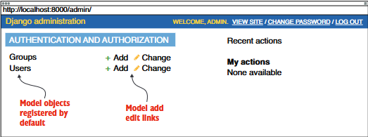
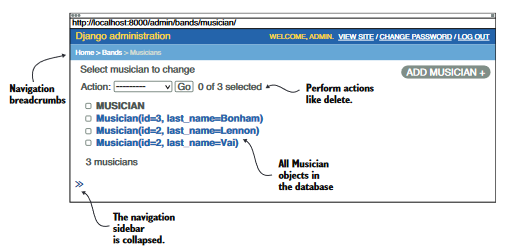
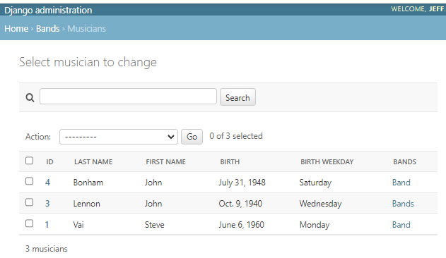

## Ch5 is about Dhango Admin

### Create a superuser
```sh
./manage.py createsuperuser
```

### The admin page


### minimum code to add a model in admin page 
```python
# proj/bands/admin.py
from django.contrib import admin
# import the model
from bands.models import Musician

admin.site.register(Musician)
```

### To customize, use ModelAdmin class to register an admin page
```python
from django.contrib import admin
from bands.models import Musician

# If you want to customize the way a model is shown in admin page, you have to use ModelAdmin
@admin.register(Musician)
class MusicianAdmin(admin.ModelAdmin):
    pass  # for now inherited ModelAdmin provides all the basic page
```


### Customize the admin page by modifying ModelAdmin attributes
Customize, Sorting, Searching and Filtering
```python
@admin.register(Musician)
class MusicianAdmin(admin.ModelAdmin):
    # list of columns to display
    list_display = ("id", "last_name", "birth",)

    # Sorting is done by clicking on table header

    # Searching
    search_fields = ("last_name", "first_name", )
    # Searching with suffixes like __startswith
    search_fields = ("last_name__startswith", "first_name__startswith", )
    # Filtering 
    list_filter = ("birth",)  # default filter for date field is Today, Past 7 days, This month, & This Year

```

### More about filters
Django comes prepackaged with some other filters. You can dive deep into the documentation to see what is available or learn to further customize on your own: 
https://docs.djangoproject.com/en/dev/ref/contrib/admin/filters/


### Cross-linking related model objects
by adding a related model
```python
@admin.register(Band)
class BandAdmin(admin.ModelAdmin):
    pass    # for now inherited ModelAdmin provides all the basic page

```

Adding a link to related Band for each musician
```python

# RiffMates/bands/admin.py
...
class MusicianAdmin(admin.ModelAdmin):
    list_display = ("id", "last_name", "first_name", "birth", "show_weekday", "show_bands")  # the 'show_weekday' & "show_bands" are callable -- not a field
    search_fields = ("last_name__startswith", "first_name__startswith", )
    # list_filter = ("birth", ) 
    list_filter = (DecadeListFilter, ) 
    
    # callable column for weekday -- customized
    def show_weekday(self, obj):
        # Fetch weekday of artist’s birth
        return obj.birth.strftime("%A") # format %A is for the weekday

    show_weekday.short_description = "Birth Weekday" # custom column header
    
    # callable column for bands -- customized
    def show_bands(self, obj):
        bands = obj.band_set.all()
        if len(bands) == 0:
            return format_html("<i>None</i>")
        
        # if more than one band, pluralize
        plural = ""
        if len(bands) > 1:
            plural = "s"
        
        parm = "?id__in=" + ",".join([str(b.id) for b in bands])
        url = reverse("admin:bands_band_changelist") + parm
        return format_html('<a href="{}">Band{}</a>', url, plural)

    show_bands.short_description = "Bands"
```
The resulting musicians admin page



### Model Meta Properties
class Meta inside model class changes the behavior of the database queries

```python
# To change the default sort order of the Musician class
class Musician(models.Model):
...
    class Meta:
        ordering = ["last_name", "first_name"


```
see https://docs.djangoproject.com/en/dev/ref/models/options/

### Index in Meta attributes
indexes make a big performance difference on query results for the fields being searched. Without an index, the database needs to scan the entire table until it finds a matching result. The index works like a hash table, providing a shortcut to finding  values.
```python
class VenueStaff(models.Model):
    # first_name, last_name, employee ID number fields
    class Meta:
        indexes = [models.Index(fields=["last_name", "first_name"])]
```

